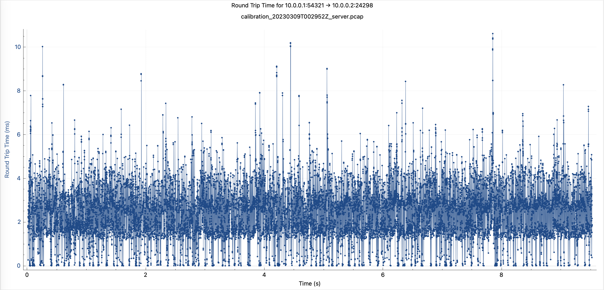
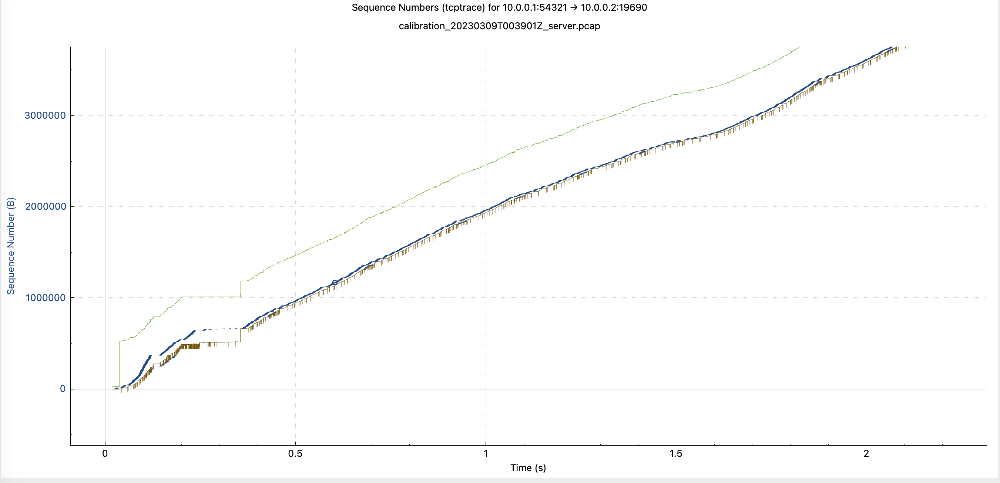
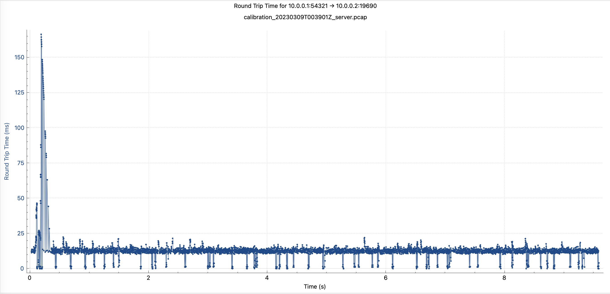
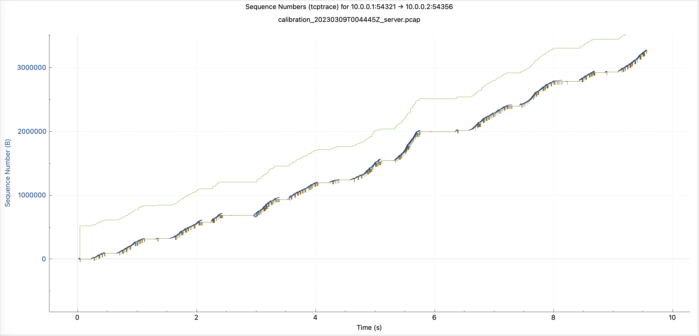
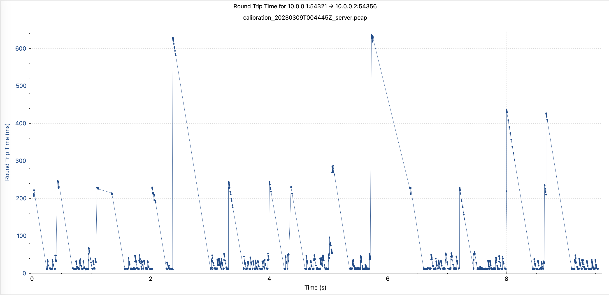

# Netem performance

We implemented this library to write integration tests for
[probe-cli](https://github.com/ooni/probe-cli). We want
to have tests to ensure we detect:

1. typical censorship techniques (e.g., connection RST by peer);

2. cases of extreme throttling.

We define cases of extreme throttling as cases where the goodput is
significantly degraded compared to ordinary connections.

Because of our these goals, this library is good enough if we can provoke
extreme throttling. We do not aim for realism in terms of
the relationship between the end-to-end connection properties (e.g.,
the round-trip time, the packet loss rate, the available bandwidth) and
the goodput value. Our less ambitious goals are the following:

1. an increase in the packet loss rate should degrade the goodput;

2. an increase of the RTT should also degrade the goodput.

In other words, what matters is the relative reduction in the goodput
rather than the actual goodput value.

We have three distinct implementations of link forwarding:

1. the _fast_ implementation connects directly the two NICs and is
therefore not suitable for these integration tests;

2. the _with delay_ implementation only knows about delays and
is not suitable to write tests with additional packet losses;

3. the _full_ implementation knows about losses and delays.

The reason why we have three implementations is that they differ
quite significantly on the overall performance. But, for the
sake of discussing our objective, here we will focus just on the
full implementation of link forwarding.

The full implementation derives from the fast implementation but
adds additional components to the model such that:

1. we avoid packet bursts;

2. we model the transmission latency;

3. we model the queing delay;

4. we model the propagation delay;

5. we allow for out of order delivery.

We are doing all of this because if we just take the _with delay_
implementation and add losses we obtain a received limited TCP
instance. In these operating conditions, TCP is extremely fragile,
and losses are catastrophic. This means that there are lots of
timeouts and the goodput we obtain is quite unpredictable.
With the five properties above, instead, we often times obtain
a congestion limited TCP, which is more robust to losses and
thus can degrade more gracefully to increasing losses.

To conduct these tests, we are going to use a 2GiB RAM, single
processor cloud machine. It makes sense to be in a limited resources
environment, because we want to run integration tests in the CI.

Let us assume we are writing an integration test where downloading
from `example.com` is not throttled while downloading from
`example.org` is throttled. Let us start by examining the former
case, using the following command:

```bash
go run ./cmd/calibrate -rtt 0.1ms -plr 1e-09 -star
```

In these working conditions `calibrate` shows a 20 Mbit/s average
goodput. Let us now examine the PCAPs `calibrate` collected.


What we see in terms of time sequence is that we are not receiver
limited, and that we are reasonably pacing packets.



In terms of RTT, we see the effects of jitter. We are currently
adding jitter the deburst ougoing packets.

Let us bump the RTT to 10 ms. (Netem allows the [DPIEngine](
https://pkg.go.dev/github.com/ooni/netem#DPIEngine) to bump the
PLR of flows classified as "bad".) We would obtain as goodput
a value around 12 Mbit/s.



Zooming in, we see a drop tail even at the beginning caused
by switches queue emulation. This event has an impact on the
measured RTT, much higher at the beginning.



Let us now increase the loss rate from 1e-09 to 5e-02. (As I said
before, we are not aiming for realism.) In this case the goodput
is around 3 Mbit/s. Let us examine the captures.



Here we see that TCP is taking many timeouts and is not able
to stabilize its delivery rate because there are too many losses.



We can see the effects of timing out also in the RTT chart.

So, it seems we can use the _full_ link model to degrade the performance
of TCP from a works-well point to a works badly point. Also, judging
from the packet traces we have seen so far, with this model there are
no crazy events like the speed being 100 Mbit/s for half a second and then
dropping to zero because TCP lost a huge backlog of data.

We will continue to examine the data and investigate. For now, though, it seems
this code is suitable to start writing some integration tests using it.
